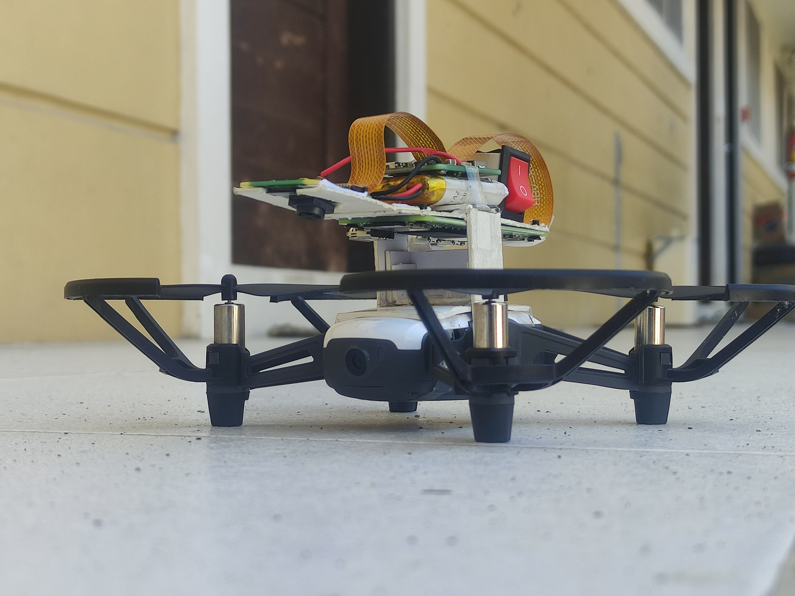
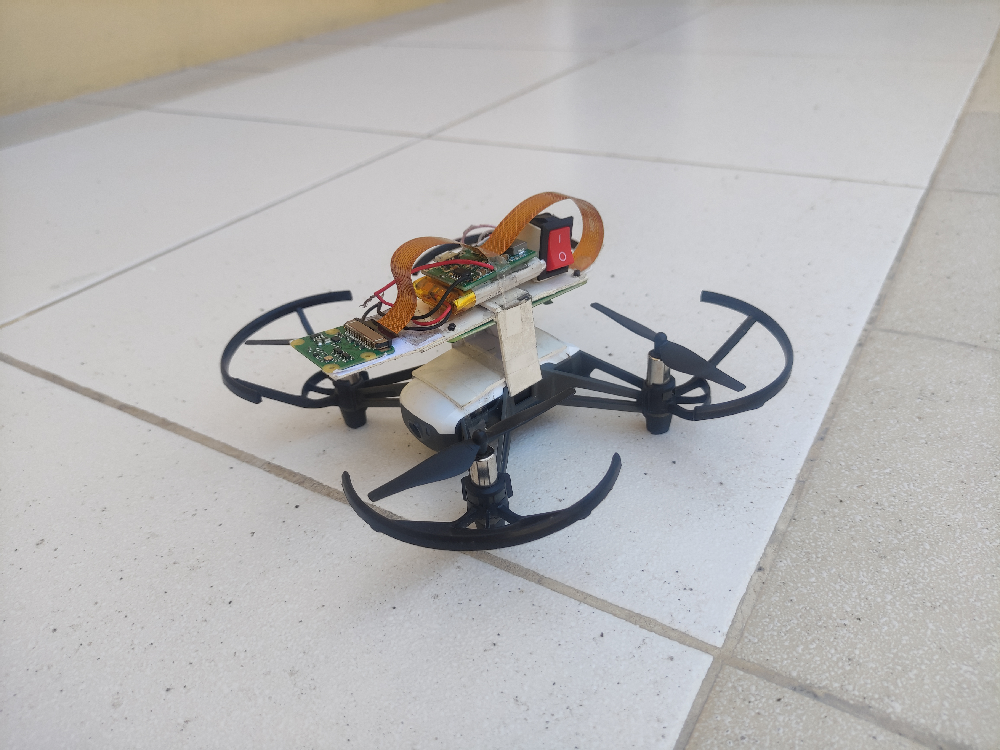
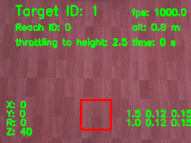
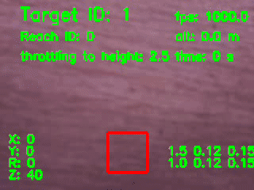
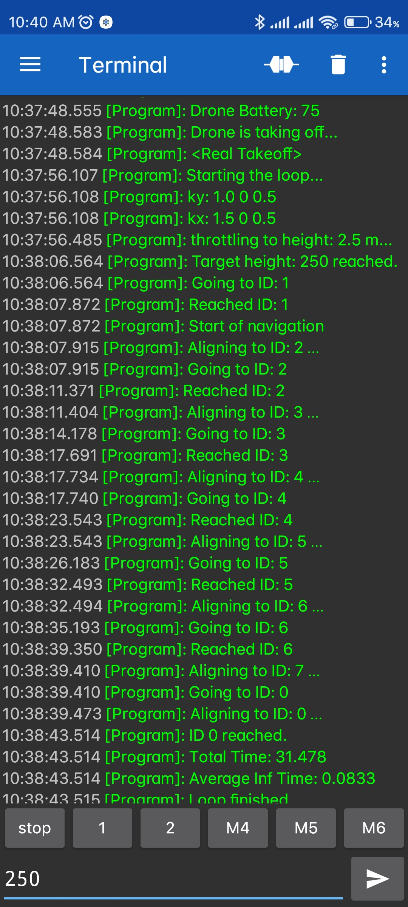

# Drone-Aruco-PID-Autonavigate
*My undergraduate thesis* - A raspberry pi program that navigates a drone horizontally following the IDs of ArUco markers.

  
  

##  
A Raspberry Pi Zero 2W is attached to view the path and send commands to a Ryze Tello drone. ArUco markers guide the movement of the drone while PID smoothens the movement.

## Flight Samples
Two samples of actual flight as seen from the pi cam can be accessed [here](https://github.com/mangabaycjake/Drone-Aruco-PID-Autonavigate/tree/main/Documentations).

  
  

## Hardware Setup
- Pi Camera Module V2 installed on the RPi captures images
- Separate [battery](https://www.lazada.com.ph/products/i2667786599-s12702717118.html) is used
- 5V [power module](https://www.lazada.com.ph/products/i1309980104-s4775296337.html)
 is used for charging and stepping up voltage

## Bluetooth Terminal
Bluetooth terminal is used with a phone to initiate the start of the program and the abortion to ensure drone safety.

</img>

## Output CSV
An output CSV [(sample)](Documentations/pos_20.882_0.0832.csv) is generated for analytics.

## Notes
- Use virtual environment when impementing in raspberry pi due to library coflicts
- For other less supported libraries (esp. opencv), try earlier versions. 

